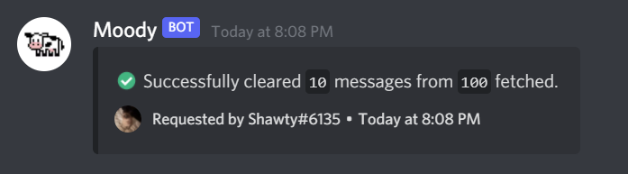

# Purge (p)

## Aliases 

* `!purge`
* `!c`
* `!sweep`
* `!clear`
* `!clearchat`
* `!yeetmessages`


THIS COMMAND IS IN BETA FORMAT ONLY BOT PARAMETER WILL WORK!


## Description 

You can target any type of message you want and delete them in bulk by using Moody's awesome clear command. All scenarios are covered too.

* We also tried our best to make the command super easy for people but also super customizable for advanced users as well.

## Permit 

Members able to use the purge commands are:

* Server Owner and Extra Owners. _`[Permit level 5]`_
* Trusted Admins _`[Permit level 4]`_
* Members with the Admin role **set in Moody**. _`[Permit level 3]`_
* Members with the Moderator role **set in Moody**. _`[Permit level 2]`_

## Preview 

## Format 


### `!purge <NO.-OF-MESSAGES> <USER/PARAMETER>` 


### `Number of messages` 

You must provide this so that Moody actually knows **how many messages** it's going to purge.

* **`!purge X`** is the syntax!


**For example,** if you want to purge the last **`100 messages`** sent in a channel, run the command **`!purge 100`** in that specific channel!


### `<INPUT>` 

Input can be the **user/role/bot** depending on what you want to purge. The syntax is **`!purge X <USER>`** where **`X`** is the **number of messages to be purged** and is the **ID/Mention/Name** or the specified user. **For example,** if you want to purge the last **`25 messages`** sent in a channel by a user named **bob**, run the command **`!purge 25 bob`** in that specific channel!


You can **mention the member, type out their username, their tag, or even their** [**ID**](https://support.discord.com/hc/en-us/articles/206346498-Where-can-I-find-my-User-Server-Message-ID-)​You don't have to type the full thing if you are sure it's the only member with a **`username/tag/id`** that starts with what you want to provide, for an example, I only that **juju** is the only member with such a name, I can just do **`!purge 50 ju`** and Moody would delete **`50`** messages sent by **juju**. You can provide a **webbook ID** or even name if you want to target that **webbook's messages**. **You can mention the role, type out's name or event it's ID if you want to target all messages sent by members who happen to have the role.**


### `<PARAMETERS>` 

Parameters are the purge options you can pass if you want extra input or a custom behaviour. **They must come after the number of messages!**If you want to target **a specific kind of message**, you need to use this parameter and actually provide the **`<PARAMETER>`** you need. If this parameter is used, **`<INPUT>`** has to be just a number!

#### Parameters available are: 

| Type        | Info                                                                  | Example          |
| ----------- | --------------------------------------------------------------------- | ---------------- |
| Suspicious  | Target messages sent by **suspicious users**                          | **`!p 50 s`**    |
| Bots        | Target **bot messages**                                               | **`!p 50 b`**    |
| Users       | Target **non-bot messages**                                           | **`!p 50 u`**    |
| No-Avatar   | Target messages sent by members with no PfPs                          | **`!p 50 noav`** |
| No-Role     | Target messages sent by members with 0 roles                          | **`!p 50 nr`**   |
| Embeds      | Target **Embed** messages                                             | **`!p 50 e`**    |
| Attachments | Target **Attachment** messages                                        | **`!p 50 a`**    |
| Links       | Target **Links** (even if they don't show a preview)                  | **`!p 50 l`**    |
| All         | Targets **all** messages and will delete every message in the channel | **`!p all`**     |

### **Embeds** 

`!purge 25 embeds`

* This command will purge `25` messages that contain **embeds** in the channel this command was used in.

### **Suspicious** 

`!purge 25 suspicious`

* This command will purge `25` messages sent by **users deemed suspicious** by moody in the channel this command was used in.

**Alias(es): `sus`**


`!p 25 sus`


### **Bots** 

`!purge 10 bot`

* This command will purge `10` messages sent by **bots** in the channel this command was used in.

**Alias(es): `bot` / `bots` / `robot` / `robots`**


* `!p 10 bot`
* `!p 10 bots`
* `!p 10 robot`
* `!p 10 robots`


### **Mention** 

`!purge 25 mention`

* This command will purge `25` messages that contain **mentions** in the channel this command was used in.

**Alias(es): `p / mention / ping / pings / @`**


* `!p 25 p`
* `!p 25 mention`
* `!p 25 ping`
* `!p 25 pings`
* `!p 25 @`


### **Reactions** 

`!purge 25 reactions`

* This command will purge `25` messages that contain **reactions** in the channel this command was used in.

**Alias(es): `r/ reaction / react / reacts`**

* `!c 25 r`

### **Emojis** 

`!purge 100 emojis`

* This command will purge `100` messages that contain **emojis** in the channel this command was used in.

**Alias(es): `emote / emotes / emoji`**

* `!p 100 -emote`
* `!p 100 emotes`
* `!p 100 emoji`

### **No Avatars** 

`!purge 70 noav`

* This command will purge `70` messages sent by **users with no avatars** in the channel this command was used in.

**Alias(es): `-na/ noavatar/ nopic`**

* `!p 70 -na`
* `!p 70 noavatar`
* `!p 70 nopic`

### **Text** 

`!purge 70 text`

* This command will purge `70` messages that only contain **text** in the channel this command was used in.

**Alias(es): `txt / txt / noimage / noembed`**

* `!p 70 txt`
* `!p 70 txt`
* `!p 70 noimage`
* `!p 70 noembed`

### **No Roles** 

`!purge 25 norole`

* This command will purge `25` messages sent by **users with no roles** in the channel this command was used in.

**Alias(es): `nr / stripped`**

* `!p 25 nr`
* `!p 25 stripped`

### **Attachments** 

`!purge 30 img`

* This command will purge `30` messages that contain **images** in the channel this command was used in.

**Alias(es): `pic / image / attach`**

* `!p 30 pic`
* `!p 30 image`
* `!p 30 attach`

### **Links** 

`!purge 50 links`


This command will purge `50` messages that contain _\*\*_ in the channel this command was used in.


**Alias(es): `l`**

* `!p 50 l`

!p 100 links

## Logging 

Moody will log any and all **purges** made using it in your **moody-logs** channel, your **mod logs** channel and in the audit logs.

* The **moody-logs** channel will have an embed that will contain information pertaining to the **purge, the mod who purged, the type of purge** and so on.

## More information regarding Purges 

**`[1.]`** Currently, more than 100 messages cannot be purged using a single command. You'd have to do it using multiple commands.

**`[2.]`** Moody also logs when someone purges message in its `moody-logging` channel


## Due to a Discord limitation, Moody can't delete messages older than 2 weeks! 

